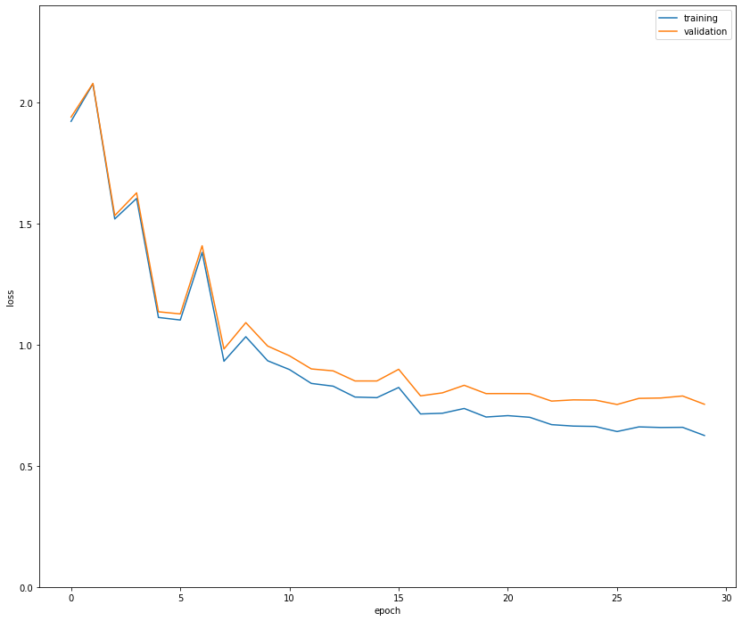
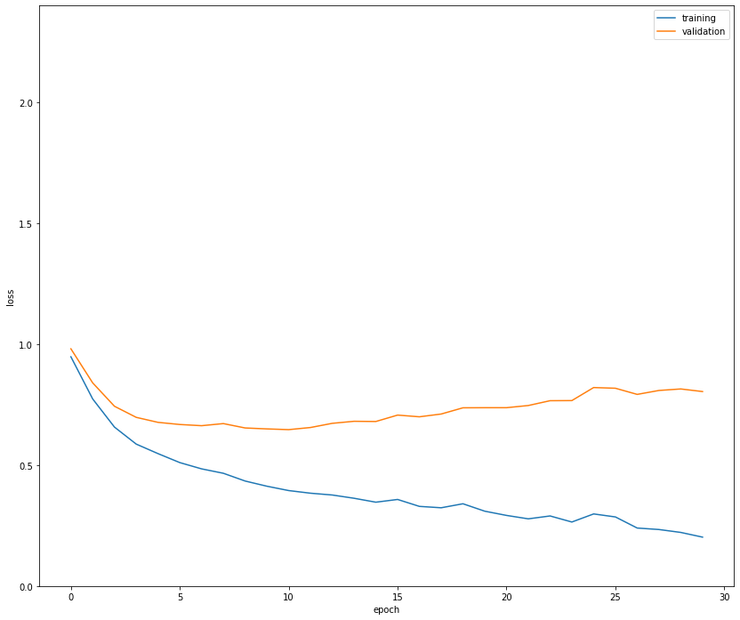
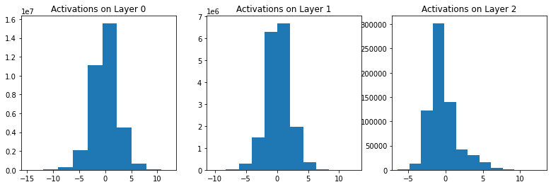
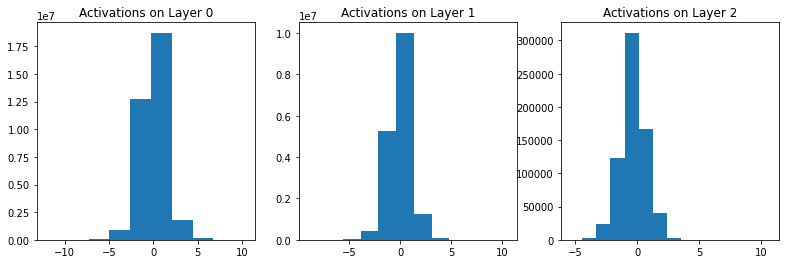

# Neural Network from scratch

In this project, we implemented a multi-layer perceptron (MLP) with an arbitrary number of layers, for multiclass classification from scratch. Then we used SVHN as a dataset to train our model. The SVHN dataset that we used consists of 90,000 32×32 colored images in 10 classes. We used 67,000 images for training, 3000 images for validation, and 20,000 images for testing. You can find the details of backward and forward implementation and details of gradient computations in the notebook. 

## Results 
In the first run, we trained a neural network with 2 hidden layers, of size 512 and 256 respectively on the SVHN dataset, for 30 epochs. We used a learning rate of 0.03, and a batch size of 100. Use the RELU activation function. Here you can find the evolution of both the training and validation losses during training.

On the next try, we saw the effect of data normalization. To avoid manipulating unseen data and data leakage, we normalized test and validation sets by using the statistics of the training set (not their own mean and standard division). Here are the results with the same config as before.

As you can see, normalization helps much faster convergence. This phenomenon can be justified by using the definition of **condition number**. In fact, by normalizing data, we are centered the data and reduce the condition number which leads better convergence. You can find more theoretical details in the description. In next to the Figures we illustrated the distribution of activation on each layer (before ReLU) for normalized and unnormalized data after one feed-forward (initialization step). We observed that after normalization the activations are much closer to the standard normal distribution for each layer. On the other hand, for unnormalized data, the distribution of activations gets far from standard normal and this difference gets more significant in the last layers. In this case, the condition number of the curvature matrix of the last activation layer for unnormalized data is equal to 483.7 and for normalized data is 54.3 which is significantly less than the unnormalized case. This difference can justify the much faster convergence of the normal model.

*Distribution of activations before normalization*

*Distribution of activations after normalization*

Another interesting phenomenon we observed in Figure.5. is that our model simply overfits when we train with normalized data. In my point of view, this the difference between optimization and learning. An optimal solution for a model will not imply better generalization. With normalizingthe training data we can achieve better convergence during gradient descent. But can worsen model generalization to out-of-domain data.
